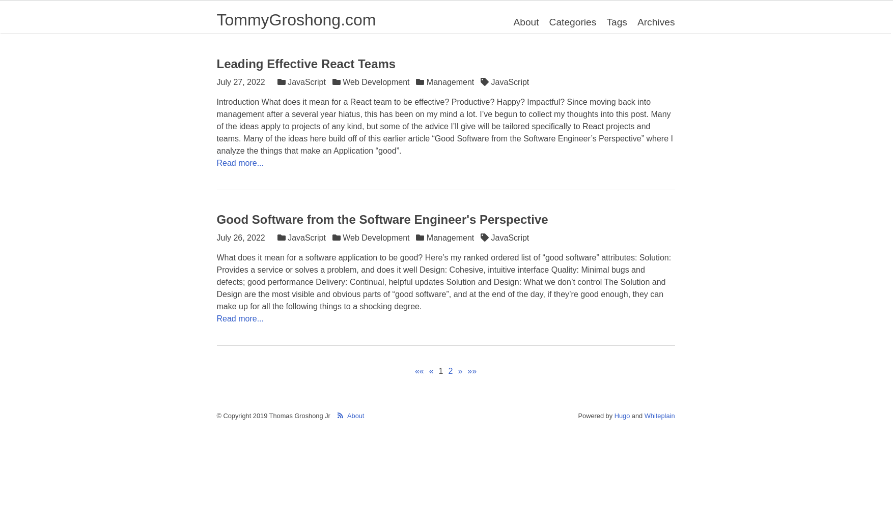

Project 1 - HTML + CSS
========================

A project to practice your HTML and CSS skills.

Recreate the following web page design on your own.
Make a single index.html file that re-creates the web page in the below screenshot as close as you
can make it.  You can point any Links to the `#` href address like so:
`<a href="#">Link</a>` which will make them act like placeholders.



Here are some HTML snippets for some of the little icons on the page:

```
<!-- Tag Icon -->

<svg class="svg-inline--fa fa-tag fa-w-16" aria-hidden="true" data-prefix="fas" data-icon="tag" role="img" xmlns="http://www.w3.org/2000/svg" viewBox="0 0 512 512" data-fa-i2svg=""><path fill="currentColor" d="M0 252.118V48C0 21.49 21.49 0 48 0h204.118a48 48 0 0 1 33.941 14.059l211.882 211.882c18.745 18.745 18.745 49.137 0 67.882L293.823 497.941c-18.745 18.745-49.137 18.745-67.882 0L14.059 286.059A48 48 0 0 1 0 252.118zM112 64c-26.51 0-48 21.49-48 48s21.49 48 48 48 48-21.49 48-48-21.49-48-48-48z"></path></svg>


<!-- Folder Icon -->

<svg class="svg-inline--fa fa-folder fa-w-16" aria-hidden="true" data-prefix="fas" data-icon="folder" role="img" xmlns="http://www.w3.org/2000/svg" viewBox="0 0 512 512" data-fa-i2svg=""><path fill="currentColor" d="M464 128H272l-64-64H48C21.49 64 0 85.49 0 112v288c0 26.51 21.49 48 48 48h416c26.51 0 48-21.49 48-48V176c0-26.51-21.49-48-48-48z"></path></svg>

<!-- RSS Feed Icon -->

<svg class="svg-inline--fa fa-rss fa-w-14" aria-hidden="true" data-prefix="fas" data-icon="rss" role="img" xmlns="http://www.w3.org/2000/svg" viewBox="0 0 448 512" data-fa-i2svg=""><path fill="currentColor" d="M128.081 415.959c0 35.369-28.672 64.041-64.041 64.041S0 451.328 0 415.959s28.672-64.041 64.041-64.041 64.04 28.673 64.04 64.041zm175.66 47.25c-8.354-154.6-132.185-278.587-286.95-286.95C7.656 175.765 0 183.105 0 192.253v48.069c0 8.415 6.49 15.472 14.887 16.018 111.832 7.284 201.473 96.702 208.772 208.772.547 8.397 7.604 14.887 16.018 14.887h48.069c9.149.001 16.489-7.655 15.995-16.79zm144.249.288C439.596 229.677 251.465 40.445 16.503 32.01 7.473 31.686 0 38.981 0 48.016v48.068c0 8.625 6.835 15.645 15.453 15.999 191.179 7.839 344.627 161.316 352.465 352.465.353 8.618 7.373 15.453 15.999 15.453h48.068c9.034-.001 16.329-7.474 16.005-16.504z"></path></svg>
```

One of your best friends on the web for learning about web things will be
the Mozilla Developer Network (MDN) docs.  It will help you answer questions
like "what does this HTML element do?"  or "how do I make this style happen
with CSS?" or "how do I animate this interaction with JavaScript?"

Here's a good text guide to getting started with HTML + CSS + JavaScript:

  - https://developer.mozilla.org/en-US/docs/Learn/Getting_started_with_the_web

Some helpful HTML tags to keep in mind when making your website:

  - `<div>`
  - `<span>`
  - `<a>`
  - `<p>`
  - `<h1>` - `<h6>`
  - `<article>`
  - `<aside>`
  - `<details>`
  - `<footer>`
  - `<header>`
  - `<main>`
  - `<nav>`
  - `<section>`

You can find explanations of these tags (and tons of others) here on MDN:
https://developer.mozilla.org/en-US/docs/Web/HTML/Element#content_sectioning

Some helpful articles:

  - https://www.freecodecamp.org/news/how-to-center-anything-with-css-align-a-div-text-and-more/
